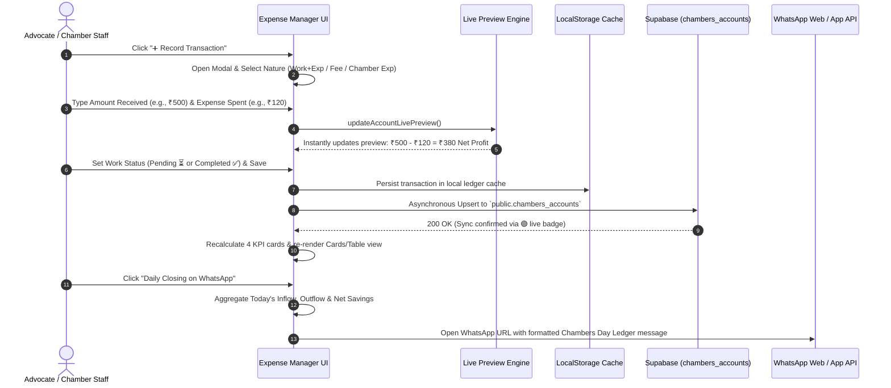
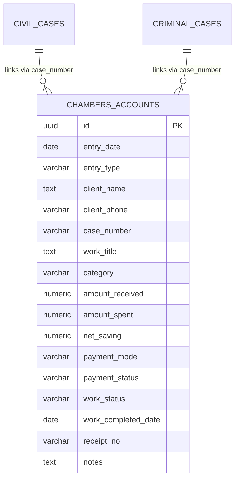

# Chambers Accounts & Expense Manager — Technical Specification & Architecture

This document contains the complete technical architecture, UI layout hierarchy, transaction workflows, and database schema for the **Chambers Accounts & Expense Manager** module in **CaseBook** (Legal Practice & Case Management System).

---

## 1. Executive Summary

- **Module Name:** Chambers Accounts & Expense Manager
- **DOM Container:** `#accounts` in `admin.html`
- **Primary Purpose:** Track daily legal practice fee receipts, client-funded court work expenditures (certified copies, court fee stamps, bail bonds, munshi clerkage), chamber operational overheads, live net profit margins, and daily WhatsApp closing distribution.
- **Architectural Pattern:** Offline-first reactive UI with LocalStorage caching and two-way Supabase Cloud PostgreSQL synchronization.

---

## 2. High-Level Component & UI Layout Hierarchy

```mermaid
graph TD
    Root["📂 Chambers Accounts & Expense Manager Tab (#accounts)"]

    %% Header Section
    Root --> Header["1. Header & Action Ribbon"]
    Header --> HTitle["Chambers Earning & Expense Manager Title & Subtitle"]
    Header --> CloudBadge["🟢 Cloud Status Badge (Local & Cloud Ready)"]
    Header --> HActions["Header Action Toolbar"]
    HActions --> ActWA["📱 Daily Closing on WhatsApp"]
    HActions --> ActCSV["📊 Export to CSV"]
    HActions --> ActPrint["🖨️ Print / A4 PDF Ledger"]
    HActions --> ActAdd["➕ Record Transaction Modal Trigger"]

    %% KPI Summary Section
    Root --> KPI["2. Real-Time Financial KPI Deck"]
    KPI --> KPI1["📥 Total Inflow (Received)<br/>₹ Received + Client Count"]
    KPI --> KPI2["📤 Total Outflow (Expenses)<br/>₹ Spent on Court Work & Overheads"]
    KPI --> KPI3["💰 Net Savings (In Hand)<br/>Chamber Net Margin + Savings %"]
    KPI --> KPI4["📋 Total Transactions<br/>Count + Active Date Filter Period"]

    %% Filter & Search Ribbon
    Root --> Filters["3. Filter & Slicing Ribbon"]
    Filters --> DatePills["Date Filter Pills<br/>(Today | Yesterday | This Week | This Month | All Time | Custom Date)"]
    Filters --> SearchBox["🔍 Live Search Box<br/>(Client name, case no., work description)"]
    Filters --> CatFilter["🏷️ Category Dropdown<br/>(Certified copy, court fee, drafting, tea, etc.)"]
    Filters --> StatusFilter["🛠️ Work Status Dropdown<br/>(Pending ⏳ | Completed ✅)"]

    %% Main View Display
    Root --> Display["4. Ledger View Area (Dual Mode)"]
    Display --> ViewSwitch["View Switcher Toggle<br/>(Cards Grid ↔ Spreadsheet Table)"]
    Display --> CardView["Card View Mode (Default)<br/>Detailed Financial Breakdown Cards<br/>Client, Case, Category Badge, Net Pill, Action Menu"]
    Display --> TableView["Spreadsheet Table Mode<br/>Columns: # | Date | Client & Case | Description | Category | Status | Mode | Recv(+) | Exp(-) | Net | Actions"]

    %% Modal
    Root --> Modal["5. Transaction Recording & Edit Modal"]
    Modal --> NaturePills["Transaction Nature Selector<br/>💼 Work + Expense | 💰 Direct Fee | 💸 Chamber Expense"]
    Modal --> FormFields["Metadata: Date, Category, Client, Case Link, Description, Quick Tags"]
    Modal --> LiveCalc["🧮 Live Calculation Preview Box<br/>(Client Gave − Spent = Net Saving)"]
    Modal --> PaymentWork["Payment Mode & Status + Work Execution Status & Completed Date"]
```



---

## 3. End-to-End Transaction Flow & Lifecycle



---

## 4. Financial Nature & Category Matrix

The system classifies all financial transactions into three distinct operational natures:

| Nature | Intended Use | Financial Flow Formula | Typical Categories |
| :--- | :--- | :--- | :--- |
| **💼 Work + Expense** (`job`) | Client-funded judicial tasks with direct disbursements | `Received (+) - Spent (-) = Net Profit` | Certified Copies, Bail Bonds, Process Fees, Summons |
| **💰 Direct Client Fee** (`income`) | Pure professional advocate fees / retainers | `100% Inflow (+)` (Spent = 0) | Consultation, Brief Drafting, Appearance / Retention |
| **💸 Chamber Expense** (`expense`) | General office overheads & chamber running costs | `100% Outflow (-)` (Received = 0) | Chamber Tea & Refreshments, Stationery, Photostat, Travel |

### Predefined Standard Categories
1. `certified_copy`: Certified Copy Work
2. `court_fee`: Court Fee Stamps & Process Fees
3. `bail_bond`: Bail Bond / Sureties Verification
4. `drafting`: Drafting & Pleading
5. `advocate_fee`: Advocate Fee / Professional Consultation
6. `clerkage`: Munshi Clerkage & Allowance
7. `typing_xerox`: Typing, Photostat & Binding
8. `travel`: Travel, Conveyance & Process Serving
9. `office_expense`: Chamber Tea, Pantry & Office Overheads
10. `miscellaneous`: Other miscellaneous expenditures

---

## 5. Database Schema (Supabase PostgreSQL)

```sql
CREATE TABLE IF NOT EXISTS public.chambers_accounts (
    id UUID PRIMARY KEY DEFAULT gen_random_uuid(),
    entry_date DATE NOT NULL DEFAULT CURRENT_DATE,
    entry_type VARCHAR(50) NOT NULL DEFAULT 'job', -- 'job', 'income', 'expense'
    client_name TEXT NOT NULL,
    client_phone VARCHAR(30),
    case_number VARCHAR(100),
    work_title TEXT NOT NULL,
    category VARCHAR(50) NOT NULL DEFAULT 'certified_copy',
    amount_received NUMERIC(12, 2) NOT NULL DEFAULT 0.00,
    amount_spent NUMERIC(12, 2) NOT NULL DEFAULT 0.00,
    net_saving NUMERIC(12, 2) GENERATED ALWAYS AS (amount_received - amount_spent) STORED,
    payment_mode VARCHAR(30) NOT NULL DEFAULT 'Cash', -- 'Cash', 'UPI', 'Bank Transfer', 'Cheque'
    payment_status VARCHAR(30) NOT NULL DEFAULT 'Completed', -- 'Completed', 'Partial', 'Pending'
    work_status VARCHAR(30) NOT NULL DEFAULT 'Pending', -- 'Pending', 'Completed'
    work_completed_date DATE,
    balance_due NUMERIC(12, 2) DEFAULT 0.00,
    receipt_no VARCHAR(50),
    notes TEXT,
    created_at TIMESTAMPTZ DEFAULT timezone('utc'::text, now()) NOT NULL,
    updated_at TIMESTAMPTZ DEFAULT timezone('utc'::text, now()) NOT NULL
);

-- Performance Indexes
CREATE INDEX IF NOT EXISTS idx_chambers_accounts_date ON public.chambers_accounts (entry_date DESC);
CREATE INDEX IF NOT EXISTS idx_chambers_accounts_client ON public.chambers_accounts (client_name);
CREATE INDEX IF NOT EXISTS idx_chambers_accounts_case ON public.chambers_accounts (case_number);
CREATE INDEX IF NOT EXISTS idx_chambers_accounts_type ON public.chambers_accounts (entry_type);
CREATE INDEX IF NOT EXISTS idx_chambers_accounts_category ON public.chambers_accounts (category);
CREATE INDEX IF NOT EXISTS idx_chambers_accounts_work_status ON public.chambers_accounts (work_status);
```

---

## 6. Entity Relationship Diagram



---

## 7. Key Features & Integrations

1. **Dual Ledger Views**: Instant switching between Visual Card Grid and High-Density Spreadsheet Table.
2. **Interactive Live Math**: Dynamic preview calculating `Client Gave − Work Spent = Net Profit` inside modal before saving.
3. **Daily WhatsApp Closing**: Aggregates all daily inflows, outflows, and net balances, generating an advocate-ready WhatsApp markdown report.
4. **CSV & PDF/Print Support**: Standard tabular export formatted for Indian financial / chamber khata audits.
5. **Offline & Cloud Synchronization**: LocalStorage caching allows full offline usage with real-time Supabase replication.
