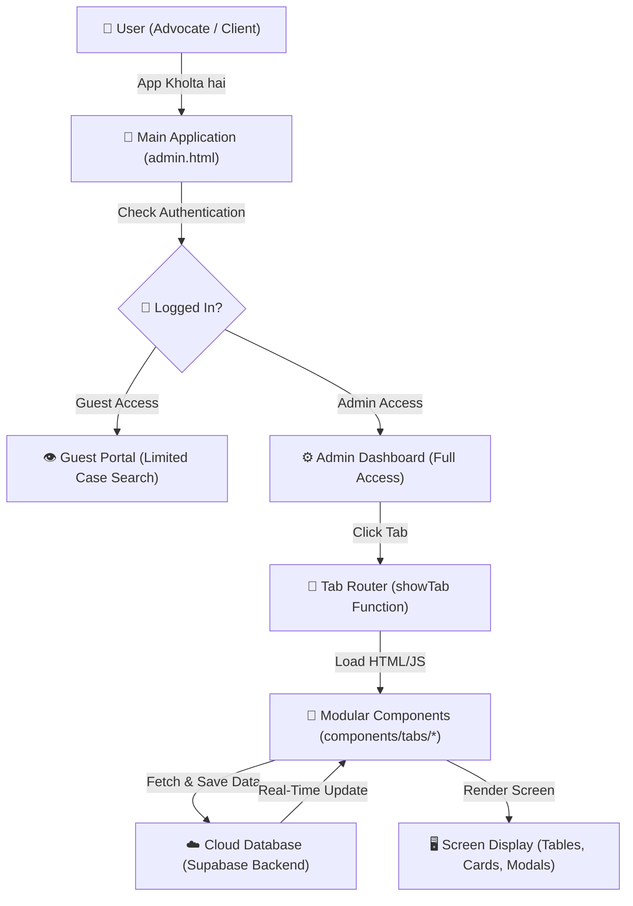

# ⚖️ CaseBook — Beginner-Friendly Guide & Documentation

> **Welcome to CaseBook!** 📘  
> Ye document bilkul simplified Hindi-English (Hinglish) me likha gaya hai taaki **koyi bhi beginner (jo abhi coding seekh raha hai)** is project ko aasaani se samajh sake, setup kar sake, aur iske code ko upgrade kar sake.

---

## 📌 Section 1: Project Kya Hai Aur Kyu Banaya Gaya? (What & Why)

**CaseBook** advocates (wakiilon) aur law chambers ke liye ek **Digital Legal Practice & Case Tracking Platform** hai. 

Purane zamane me wakiil saahab apne cases, agli taareekh (hearing dates), clients ke phone numbers aur paison ka hisaab-kitaab kagaz ki moti diaries aur registers me likhte the. **CaseBook iska digital replacement hai.**

- **Project Kyu Banaya Gaya?**: Advocates ko court hearings, cases ki agli date, daily cause-list (taareekhon ki list), client payments, aur to-do tasks ko ek hi jagah bina kisi paper work ke manage karne ke liye banaya gaya hai.

💡 **Real-Life Analogy (Aasan Example)**:  
> Socho ek advocate ki physical chamber hai. Us chamber me ek **Maha-Register** hai jisme sabhi cases likhe hain, ek **Wall Calendar** hai jisme daily court dates hain, aur ek **Gullak / Cash Box** hai jisme fees ka hisaab hai.  
> **CaseBook** in sabhi physical cheezon ko ek sundar, mobile-friendly **Software Application** me convert kar deta hai!

---

## 🔄 Section 2: Ye Project Kaise Kaam Karta Hai? (Project Flow & Architecture)

Is project me **Single-Page Modular Architecture** [baat ye hai ki puri website ek hi main page par chalti hai, aur alag-alag features chhote-chhote HTML/JS boxes (modules) me bat-te hain] ka use hua hai.

### 🚗 Step-by-Step User Journey:
1. **User Login**: User app kholta hai aur Guest Portal ya Admin Password se enter karta hai.
2. **Tab Switch**: User sidebar (side menu) se kisi bhi feature (jaise `Upcoming Hearings`, `Cause List`, `Add Case`, `Paisa Manager`) par click karta hai.
3. **Dynamic Loading**: JavaScript background me us tab ka HTML aur data load karti hai.
4. **Data Sync**: Sabhi cases aur updates **Supabase** [Cloud Database — Internet par aapki digital almirah] par real-time save hote hain.

### 🎨 Visual Flowchart Diagram (Mermaid):



---

## 🛠️ Section 3: Setup Kaise Kare? (Step-by-Step Installation)

Is project ko chalane ke liye kisi heavy backend server (Node.js backend or Python server) ki zaroorat nahi hai! Ye ek **Pure Front-End Web Application** hai jo HTML, CSS, JavaScript aur Supabase se chalti hai.

### 📋 Prerequisites (Pehle Se Kya Chahiye?):
- Any Web Browser (Google Chrome, Microsoft Edge, Brave, ya Firefox).
- [VS Code Editor](https://code.visualstudio.com/) (Code dekhne aur edit karne ke liye).
- Live Server Extension (VS Code me) ya [Node.js](https://nodejs.org/) installed.

---

### 🚀 Step 1: Repository Clone Ya Download Kare

Pehle project source code ko apne computer me layen:

```bash
# Git Command (Command Prompt ya Terminal me chalayein):
git clone https://github.com/Atulmishra2/caseBook.git

# Project folder ke ander jayein:
cd caseBook
```

* **Why?** [Ye step Internet se saara project code aapke local computer me copy karta hai.]

---

### 🚀 Step 2: Project Ko Run / Launch Kare

#### Method A: VS Code Live Server Se (Subse Aasan Method):
1. VS Code me `caseBook` folder open karein (`File -> Open Folder`).
2. Left side file explorer se `admin.html` par click karein.
3. Right click karke **"Open with Live Server"** select karein.
4. Browser automatically `http://127.0.0.1:5500/admin.html` par app open kar dega!

#### Method B: Node.js / `http-server` Terminal Se:
Agar aap terminal use karna chahte hain:

```bash
# 1. Light-weight web server install karein (Sirf ek baar):
npm install -g http-server

# 2. Project folder me server start karein:
npx http-server . -p 8080
```

Browser me jayein aur open karein: `http://localhost:8080/admin.html`

* **Why?** [Direct `file:///` path par browsers security karan se ServiceWorker ya Supabase API block kar sakte hain. HTTP Server chalane se app real website jaisi behave karti hai.]

---

## 📁 Section 4: File Structure & Module Directory

Pura project **Clean Modular Architecture** me divided hai taaki aage chalkar code maintain karna bohot aasan rahe.

```
caseBook/
│
├── 📄 admin.html                  # Main Admin App Shell (App ka main ghar aur HTML frame)
├── 🎨 admin.css                   # Global Core CSS Styles (Main styling, themes & layout rules)
├── ⚙️ admin.js                    # Main Application Logic (Tab switcher, modal handlers, state)
├── 🌐 index.html                  # Public Landing / Mobile PWA Entry Page
│
├── 📂 components/                 # Modularity Directory (Sabhi app components ka ghar)
│   ├── 📜 global-rules.css        # Universal UI Design Rules, Color Themes & Unified Badges
│   ├── 🦶 chambers-footer.js      # Dynamic Modern Chambers Footer Component
│   │
│   └── 📂 tabs/                   # 21 Modular Tabs (Har feature ka apna HTML, CSS, JS folder)
│       ├── 📂 about/              # About System & Developer Info Tab
│       ├── 📂 add/                # New Case Registration Form Tab
│       ├── 📂 all/                # All Cases Master Data Table Tab
│       ├── 📂 calendar/           # Monthly & Weekly Hearing Calendar Scheduler Tab
│       ├── 📂 cards/              # Interactive Visual Case Cards Board Tab
│       ├── 📂 causelist/          # Daily Court Cause List Appearance Board Tab
│       ├── 📂 courts/             # Judicial Forums & Courts Directory Tab
│       ├── 📂 delete/             # Case Deletion Archive & Trash Management Tab
│       ├── 📂 disposed/           # Decided & Disposed Cases History Tab
│       ├── 📂 hearing/            # Forward Hearing Dates & Next Stage Update Tab
│       ├── 📂 helpers/            # Court Staff, Munshi & Clerk Directory Tab
│       ├── 📂 home/               # Primary Executive Dashboard Analytics Tab
│       ├── 📂 paisa/              # Practice Accounts, Client Fees & Expenses Tab
│       ├── 📂 search/             # Deep Dossier & Case Particulars Search Tab
│       ├── 📂 settings/           # System Backup, Cloud Export & Sync Settings Tab
│       ├── 📂 themes/             # 8 Color Theme Selector & Customizer Tab
│       ├── 📂 todo/               # Chamber Tasks, Work Order & To-Do List Tab
│       ├── 📂 transfer/           # Case Transfer between Courts Tracker Tab
│       ├── 📂 undated/            # Un-scheduled / Undated Cases Recovery Tab
│       └── 📂 upcoming/           # 7-Days Upcoming Hearing Radar Tab
│
├── 📂 services/                   # Cloud Backend Services (Data fetching & database logic)
│   ├── ⚡ supabaseClient.js       # Supabase Cloud Database Connection Client
│   ├── 📁 caseService.js          # Case Records CRUD Operations (Create, Read, Update, Delete)
│   ├── 💰 paisaService.js         # Financial Income & Expense Cloud Sync Operations
│   └── 📝 todoService.js          # To-Do Tasks & Work Status Sync Operations
│
├── 📂 utils/                      # Helper Functions (Utility functions)
│   ├── 📅 dateUtils.js            # Date formatting (DD/MM/YYYY) & Hearing countdown math
│   ├── 📤 exportUtils.js          # PDF Print, Excel Export & CSV Backup generation
│   └── 🎨 uiUtils.js              # Toast Notifications, Loading Spinners & Alert Modals
│
├── 📂 store/                      # State Management
│   └── 🧠 globalStore.js          # In-memory Case & Accounts Data Central Store
│
└── 📄 sw.js                       # Service Worker (Offline PWA Mobile Support)
```

---

### 🔗 Kaun Si File Kis Se Connected Hai? (Connections Table)

| File Name | Connected To | Connection Ka Purpose (Kyu Juda Hai?) |
| :--- | :--- | :--- |
| **`admin.html`** | `admin.css`, `admin.js`, `components/tabs/*` | App ka main skeletal body. Ye sabhi CSS/JS files aur sub-tabs ko ek jagah jorta hai. |
| **`admin.js`** | `services/caseService.js`, `store/globalStore.js` | App ka dimag (Brain). Tab switching, Search, Filters aur Modal popups control karta hai. |
| **`services/supabaseClient.js`** | Supabase Cloud Database | App ko internet par moujood live Database se connect karta hai taaki mobile/laptop dono me data sync rahe. |
| **`components/tabs/*/*.js`** | `admin.js`, `components/tabs/*/*.html` | Specific tab ka visual structure aur layout HTML payload return karta hai. |
| **`components/global-rules.css`** | All HTML files | Uniform design system (8 Color Themes, pill buttons, badges, scrollbars) enforce karta hai. |

💡 **Real-Life Analogy**:  
> Think of **`admin.html`** like a **Car Body**, **`admin.js`** like the **Engine**, **`services/`** like the **Fuel Tank (Database Data)**, and **`components/tabs/`** like the **Seats & Dashboard Accessories**.

---

## ❓ Section 5: Common Errors & Unke Solutions (Troubleshooting Guide)

Development ya running ke waqt agar koyi error aaye, toh neeche diye gaye solution follow karein:

### ❌ Error 1: "ServiceWorker registration failed: URL protocol 'file://' is not supported"
- **Kyu Aata Hai?**: Jab aap `admin.html` par double click karke direct browser me kholte hain (`file:///D:/caseBook/admin.html`).
- **Solution**: Project ko **Live Server** (VS Code) ya `http-server` command se chalayein (`http://localhost:8080/admin.html`).

---

### ❌ Error 2: "Supabase data load nahi ho raha / Data empty dikh raha hai"
- **Kyu Aata Hai?**: Internet connection disconnect hone par ya Supabase credentials mismatch hone par.
- **Solution**: 
  1. Internet connection check karein.
  2. Browser console open karein (`F12 -> Console`).
  3. App auto-fallback karke Local Browser Storage (`localStorage`) se data load kar legi.

---

### ❌ Error 3: "SideNav (Menu) open hone par screen tap se collapse nahi ho raha"
- **Kyu Aata Hai?**: `sidebarOverlay` click handler bind na hone par.
- **Solution**: Ensure karein `#sidebarOverlay` par `onclick="closeMobileSidebar()"` binded ho. (`admin.js` me automatic global document click listener fixed hai).

---

### ❌ Error 4: "Case Card par click karne se Modal nahi khul raha"
- **Kyu Aata Hai?**: `caseDetailsFullModal` DOM element html file me missing hone par.
- **Solution**: Ensure `admin.html` me `<div id="caseDetailsFullModal">` container script loading space me present ho.

---

## 🎨 Section 6: Color Themes & Customization Guide

CaseBook me **8 Built-in Themes** hain jo single click me badal jaati hain:
1. 🟢 **Mint Theme** (Default Legal Chamber Emerald)
2. 🌲 **Forest Theme** (Deep Nature Green)
3. 🌊 **Azure Theme** (High-Court Oceanic Blue)
4. 💼 **Executive Theme** (Corporate Slate Dark)
5. 🌙 **Midnight Theme** (OLED Pure Black)
6. 🍃 **Mint Soft** (Light Clean Mint)
7. 🏢 **Corporate** (Navy Professional)
8. 📜 **Classic** (Traditional Legal Parchment)

Themes badalne ke liye App me **Themes Tab** ya Header me **Theme Toggle Button** par click karein.

---

## 👨‍💻 Developer & Maintainer

- **Developer**: Advocate Atul Kumar Mishra
- **Jurisdiction**: District & High Courts
- **Platform**: CaseBook Legal Management System v8.17

---

*CaseBook is built with ❤️ for Advocates & Legal Practitioners.*